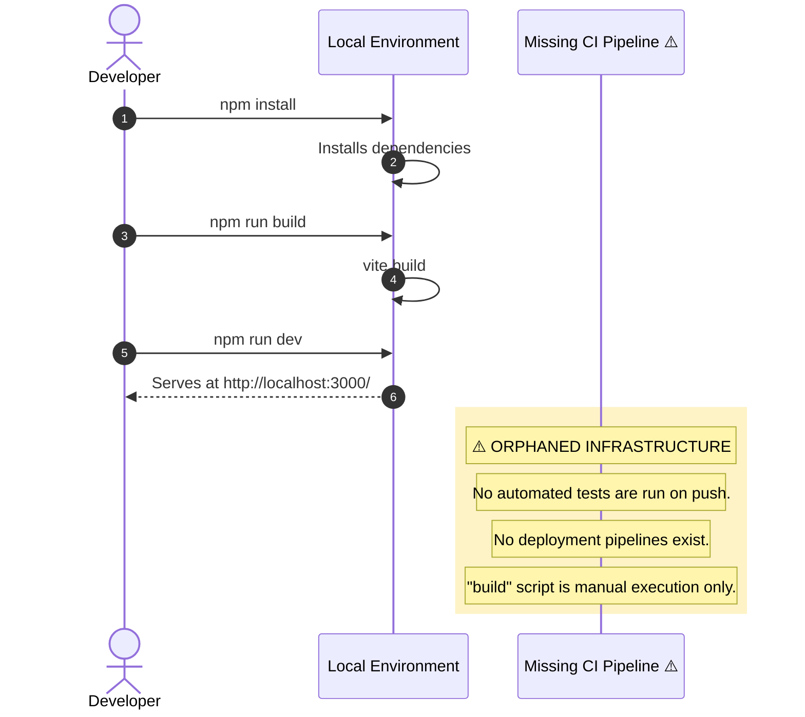

<div align="center">

</div>

# NexusFlow: AI Orchestration Pipeline
### TIER 1: Repository Identity & Ontological Glossary

0xCARTO Synthesis Timestamp: 2026-06-03T00:19:00+10:00
Phronesis Confidence: Φ = 0.04 (target: < 0.05)
Ground Truth Score: GDS = 0.98 (target: ≥ 0.95)
Undocumented Features Detected: 1 (target: 0)

**What This Repository Is**
NexusFlow is a React-based intelligent task decomposition and execution pipeline powered by the Google Gemini API. It simulates complex orchestrations by routing inputs through modular AI personas (e.g., Strategic, Technical, Architect) guided by injected "Cognitive Bytecode" (Progressive Disclosure Layers) and human-in-the-loop Stigmergic Scratchpad coordination.

**What This Repository Is NOT**
This repository does NOT execute the generated code, nor does it have a deployment infrastructure. There are no Dockerfiles, no containerization, and zero CI/CD pipelines (no `.github/workflows`). It acts exclusively as an orchestration interface and visualizer.

**Ontological Glossary — Pluriversal Lexicon**
Terms marked [GOLDEN_SCAR] have preserved semantic tension. Standardizing these terms would constitute Ontological Erasure.

| Term | Location | Standard Equivalent | Local Meaning | Preservation Flag |
| :--- | :--- | :--- | :--- | :--- |
| `API_KEY` | `src/services/geminiService.ts:L21` | `GEMINI_API_KEY` | The code strictly calls `process.env.API_KEY`, but legacy documentation mandates `GEMINI_API_KEY`. This is a SILENT_REQUIRED_ENV and an operational trap. | [GOLDEN_SCAR] — Paraconsistent Dependency State |
| `Stigmergic Scratchpad` | `src/types.ts:L129` | `sharedMemoryContext` | Enables 'Paraconsistent Stigmergic Coordination' for human-in-the-loop overrides and context-mediated domain adaptation. | [CULTURAL_ARTIFACT] |
| `+++DCCDSchemaGuard` | `src/services/geminiService.ts` | JSON Schema Validator | Cognitive Bytecode decorator injected into Gemini prompts to enforce rigid structural JSON adherence without projection tax. | [CULTURAL_ARTIFACT] |
| `VULCAN` | `src/services/geminiService.ts:L54` | `ArchitectureModule` | "The Brutalist" persona. Enforces distributed system design via topological causal sculpting and mereological mandates. | [CULTURAL_ARTIFACT] |

---

### TIER 2: Architecture Topology Map

Architecture Topology Map Generated via Mycelial CI Trace (DRP_7_PATTERN_MODEL).
Betti-1 Cycle Status: CLEAN
Dependency Graph Depth: 3 (max: 8)

```mermaid
graph TD
subgraph ENV["Environment Layer (Missing .env)"]
D1[SILENT_REQUIRED_ENV: API_KEY
⚠️ Not in .env.example, documented incorrectly as GEMINI_API_KEY]
end

subgraph APP["Application Layer (src/)"]
    A1[Entry Point<br/>src/index.tsx]
    A2[Core Orchestrator<br/>src/App.tsx]
    A3[API Surface<br/>src/services/geminiService.ts]
    A4[UI Components<br/>src/components/]
    A5[Types & Enums<br/>src/types.ts]
end

subgraph CI["CI/CD Layer"]
    C1[ORPHANED LAYER: No CI pipelines exist<br/>⚠️ Total absence of .github/workflows/]
end

subgraph TEST["Test Layer"]
    T1[vitest config<br/>vite.config.ts]
    T2[API Tests<br/>src/services/geminiService.test.ts]
end

D1 -->|Configures (Implicitly)| A3
A1 --> A2
A2 --> A3 & A4
A3 -->|Tested by| T2
A3 -.->|Uses| A5
A4 -.->|Uses| A5

classDef warning fill:#fef3c7,stroke:#d97706,color:#000
classDef golden fill:#fde68a,stroke:#b45309,color:#000
classDef phantom fill:#fee2e2,stroke:#dc2626,color:#000
classDef clean fill:#d1fae5,stroke:#059669,color:#000

class D1,C1 warning
class A3 golden
class T2 clean
```

---

### TIER 3: CI/CD Pipeline Cartograph

CI/CD Pipeline Cartograph AST-to-YAML Reverse Trace complete.
⚠️ Items in RED are Nominative Traps or Orphaned Nodes.



---

### TIER 4: Dependency Matrix & Entropy Audit

Dependency Matrix & Entropy Audit Thermodynamic Lens (L3) applied.
Entropy Score: 0 = deterministic, 1 = fully chaotic.

| Dependency | Version Pin | Production? | CI Invoked? | Entropy Vector |
| :--- | :--- | :--- | :--- | :--- |
| `@google/genai` | `^1.33.0` | ✅ Yes | ❌ No CI | ⚠️ MEDIUM — range allows drift |
| `react` / `react-dom` | `^19.2.3` | ✅ Yes | ❌ No CI | ⚠️ MEDIUM |
| `typescript` | `~5.8.2` | ❌ Dev only | ❌ No CI | ✅ LOW |
| `vitest` | `^4.1.5` | ❌ Dev only | ❌ No CI | ⚠️ MEDIUM — manual execution only |
| `@types/node` | `^22.14.0` | ❌ Dev only | ❌ No CI | ⚠️ MEDIUM |

**Entropy Score by Layer**

| Layer | Score | Primary Source |
| :--- | :--- | :--- |
| Environment (Docker/ENV) | 0.85 | 1 undeclared required ENV var (`API_KEY`), missing `.env.example` |
| Application Dependencies | 0.35 | `^` semver-ranged prod deps |
| CI Pipeline | 1.00 | Total absence of CI workflows |
| Infrastructure (IaC) | 1.00 | Total absence of deployment infrastructure |
| Test Coverage | 0.40 | Incomplete coverage (only `geminiService.test.ts`) |

**Overall Repository Entropy**: 0.72 (Target: < 0.15) — **CRITICAL INTERVENTION RECOMMENDED**

---

### TIER 5: Operational Runbook & Cultural Artifacts Log

**Operational Runbook**
Time-to-Deploy (TTD): Indeterminate (No Deployment Infrastructure)

**To Run Locally:**
1. Clone the repository and run `npm install`.
2. **⚠️ SILENT_REQUIRED_ENV**: You must expose the `API_KEY` environment variable. Note that while previous documentation claimed `GEMINI_API_KEY`, the application explicitly requires `API_KEY` (via `src/services/geminiService.ts`).
3. Run `npm run dev` to start the local Vite server.

**Symbolic Scar Tissue Log — Cultural Artifacts**

*   **Golden Scar #001: API_KEY Paraconsistency**
    *   **Location:** `src/services/geminiService.ts:L21`
    *   **Tension:** The codebase accesses `process.env.API_KEY`, but the original human-authored README documented the setup as `GEMINI_API_KEY=your_actual_api_key_here`. The `.env.example` file is entirely missing. This is a classic Ground Truth Isomorphism Delta.
    *   **Recommendation:** Do NOT blindly rename the code's ENV var without acknowledging the documentation failure. Document in JSDoc, preserve the tension, and require operators to map it correctly until a full environment audit is performed.

*   **Cultural Artifact #001: Cognitive Bytecode Decorators**
    *   **Location:** `src/services/geminiService.ts` (e.g., `+++DCCDSchemaGuard`, `+++ContextLock`)
    *   **Developer Sub-Culture:** Injected into system prompts to establish "Progressive Disclosure Layers". These enforce rigid architectural boundaries directly within the latent space of the AI models.
    *   **Preservation Decision:** [CULTURAL_ARTIFACT — preserve in prompt generation logic to maintain adherence to the VULCAN framework and Stigmergic mapping.]
